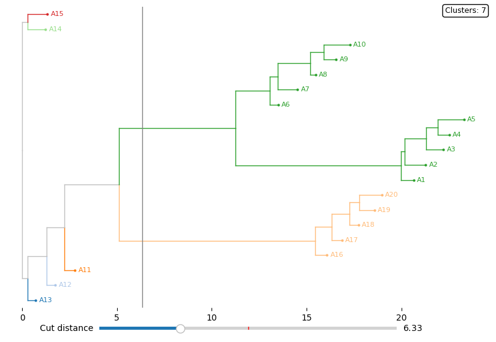

# NJ Implementation and Tree Visualization

Orodje za izračun in interaktivno vizualizacijo filogenetskih dreves nastalih z algoritmom združevanja sosedov.

### Funkcionalnosti

- implementacija algoritma združevanja sosedov
- implementacija izrisa nastalega drevesa
- prikaz delovanja na:
  - sintetičnih podatkih
  - primerih podatkov, ki so dostopni v Orange-u


### Struktura repozitorija

```
repo/
│
├── src/
│ ├── nj_core.py
│ ├── nj_orange.py
│ └── nj_visualization.py
│
├── demos/
│ ├── demo_synthetic_matrix.py
│ └── demo_orange_datasets.py
│
├── images/
│ └── tree_demo.png
│
├── requirements.txt
├── .gitignore
└── README.md
```

### Opis map in datotek

#### `src/`
Modularni del projekta, kjer se nahaja celotna logika.

- **`nj_core.py`**  
  Implementacija algoritma združevanja sosedov:
  - `TreeNode` razred
  - `neighbor_joining_core()`
  - `to_newick()`

- **`nj_orange.py`**  
  Povezovalni modul za uporabo Orange3 matrik razdalj (`DistMatrix`):
  - `neighbor_joining_orange(dm, labels)`  

- **`nj_visualization.py`**  
  Interaktivni prikaz drevesa z Matplotlib.
  - drsnik za rezanje drevesa po razdalji
  - barvanje gruč
  - hover poudarek

#### `demos/`
Primeri uporabe, ločeni od implementacije.

- **`demo_synthetic_matrix.py`**  
  Primer na sintetični matriki razdalj velikosti ```20x20```.

- **`demo_orange_datasets.py`**  
  Prikaz delovanja na treh podatkovnih množicah dostopnih v Orange-u:
  - Iris
  - Zoo
  - Housing

### Namestitev in uporaba
Namestitev potrebnih knjižnic: ```pip install -r requirements.txt```

Zagon demo primerov: 
- ```python demos/demo_synthetic_matrix.py```
- ```python demos/demo_orange_datasets.py```

### Primer vizualizacije

