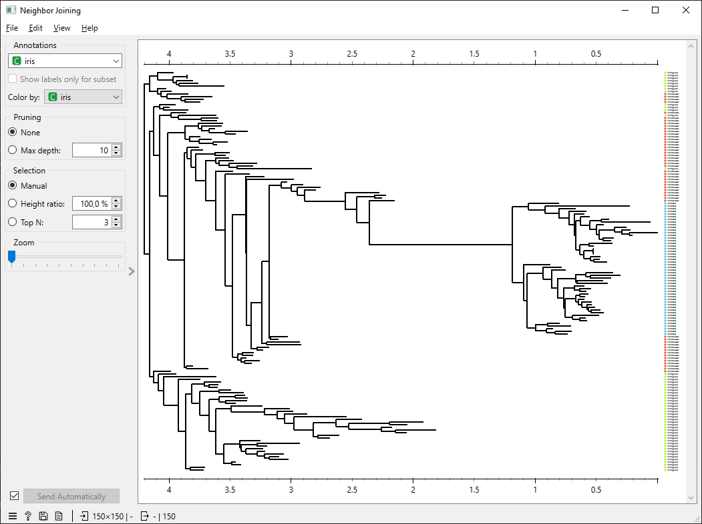
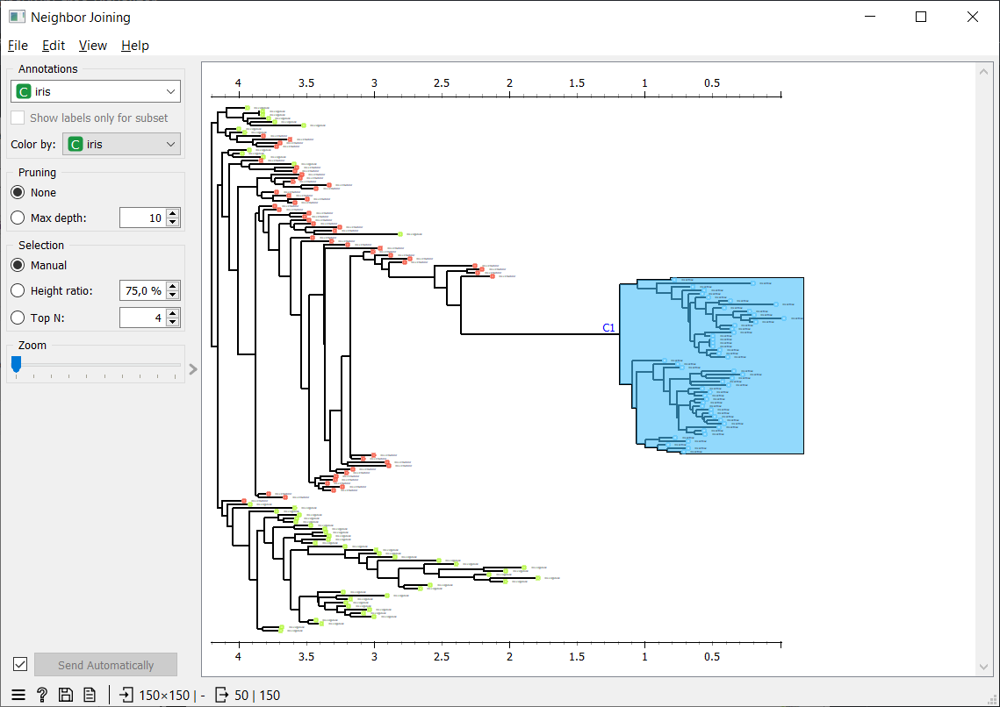
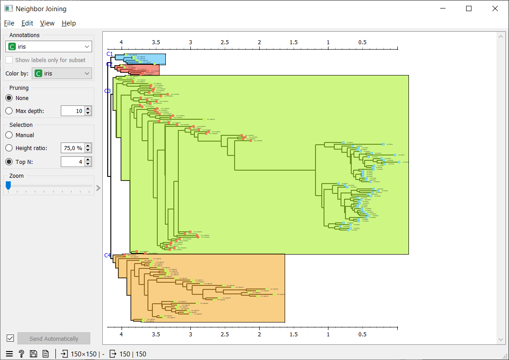

# Neighbor Joining (Orange widget)

Repozitorij vsebuje implementacijo Neighbor Joining (NJ) algoritma in interaktivni widget za vizualizacijo dendrogramov, zasnovan za okolje Orange.


### Funkcionalnosti

Widget ponuja interaktivno vizualizacijo in analizo NJ dreves, zgrajenih iz matrik razdalj. Omogoča:

- **Obrezovanje drevesa (pruning)**, ki omeji globine prikazanega dendrograma.
- **Ročno izbiro gruč (manual selection)**, kjer lahko uporabnik neposredno označi posamezne gruče z miško.
- **Izbor po razmerju višine (height ratio)**, ki uporablja premično rezalno črto (cut line) za določanje reza v dendrogramu in samodejno oblikovanje gruč.
- **Samodejno delitev na želeno število gruč (Top N)**, kjer se drevo razdeli na n gruč.
- **Povečevanje in pomanjševanje prikaza (zoom)**, ki omogoča natančnejši pregled dendrograma in oznak.


### Opis repozitorija

#### `src/`
Modularni del projekta, kjer se nahaja celotna implementacija.

- **`nj_core.py`**  
  Vsebuje implementacijo NJ algoritma skupaj z minimalno drevesno strukturo in izvozom v Newick format.

- **`adapter.py`**  
  Pretvori NJ drevo (`TreeNode`) v strukturo `Orange.clustering.hierarchical.Tree` z absolutnimi višinami, primerno za vizualizacijo v Orange-u.

- **`dendrogram_nj.py`**  
  Implementira razširjen dendrogram widget, ki podpira ne-ultrametrična drevesa.

- **`owneighborjoining.py`**  
  Orange widget, ki povezuje vhodno matriko razdalj, NJ algoritem, prilagoditev drevesa in uporabniški vmesnik.

#### `tests/`
Enotski testi za preverjanje pravilnosti algoritma.

- **`test_nj_core.py`**  
  Primerja delovanje NJ algoritma v `nj_core.py` z delovanjem v **scikit-bio** in **Biopython**.

#### `demos/`
Prikaz delovanja na treh podatkovnih množicah dostopnih v Orange-u (Housing, Iris, Zoo).

- **`demo_housing.py`**  
- **`demo_iris.py`**  
- **`demo_zoo.py`**  


### Uporabniški vmesnik


*Osnovni prikaz Neighbor Joining dendrograma na podatkovni množici Iris.*


*Ročna izbira gruč v dendrogramu.*


*Samodejna razdelitev dendrograma na izbrano število gruč (Top N).*


### Namestitev in uporaba
Namestitev potrebnih knjižnic: ```pip install -r requirements.txt```

Zagon demo primerov: 
- ```python demos/demo_housing.py```
- ```python demos/demo_iris.py```
- ```python demos/demo_zoo.py```